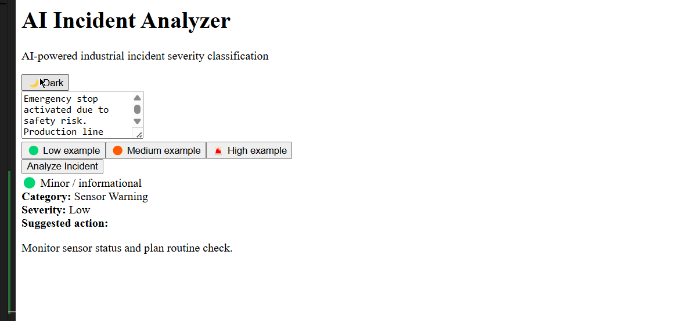

# 🚨 AI Incident Alert Workflow (n8n + Slack)

This repository contains an **AI-powered incident classification and alerting workflow** built with **n8n** and **Slack**.

The system analyzes incoming incident descriptions, classifies them using an AI model, evaluates their severity, and automatically sends **real-time alerts to Slack** when high-severity incidents are detected.

---

## 🧠 How It Works

1. Incident data is received through a **Webhook**
2. An **AI model** analyzes the incident and returns:
   - Category
   - Severity (Low / Medium / High)
   - Recommended action
3. The workflow evaluates the severity:
   - **High severity → Slack alert**
4. The alert is posted to a dedicated Slack channel (e.g. `#incidents`)

---

## 🔁 Workflow Overview

```text
Webhook
 → AI Incident Classification
 → Data Formatting (JavaScript)
 → Severity Check (If node)
 → Slack Notification (High severity only)
💬 Example Slack Alert
vbnet
Copier le code
🚨 HIGH SEVERITY INCIDENT
Category: Machine Breakdown
Severity: High
Action: Immediate machine inspection and repair, halt production line to ensure safety.
🛠 Tech Stack
n8n – Workflow automation

Slack API – Incident notifications

AI / LLM – Incident classification

JavaScript – Data transformation and logic

🎯 Use Cases
Industrial incident monitoring

Production line safety alerts

Operational incident escalation

AI-assisted decision support

🚀 Status
✅ Fully functional
🔒 Production-ready logic
🔄 Easily extensible (Email, SMS, on-call escalation, human approval)

📌 Notes
Slack authentication is handled via OAuth

The Slack bot must be invited to the target channel

Designed with human-in-the-loop workflows in mind

### Frontend (React + TypeScript)

A simple web interface allows users to submit industrial incident descriptions.
The frontend sends incidents to an n8n webhook, receives structured AI analysis,
and displays the classification result in real time.

Features:
- Incident input form
- Async request handling
- AI-powered classification result display
- Integration with Slack alerting workflow

🧠 AI Incident Analyzer

AI Incident Analyzer is a web application designed to analyze industrial incident descriptions using artificial intelligence.
It classifies incidents by severity (Low, Medium, High) and automatically triggers operational alerts for critical situations.

🚀 Features

AI-based incident severity classification

Real-time analysis from a simple web interface

Automated workflow orchestration using n8n

Conditional alerting via Slack for high-severity incidents

Clean, demo-ready UI built with React and Tailwind CSS

🏗 Architecture Overview

The user submits an incident description through the frontend.

The request is sent to an n8n webhook.

An AI model analyzes the text and returns a structured JSON response.

The incident severity is evaluated:

High severity → Slack alert is triggered.

Medium / Low severity → No alert, informational only.

The result is returned to the frontend and displayed to the user.

🛠 Tech Stack

Frontend: React, TypeScript, Tailwind CSS

Automation: n8n

AI: Large Language Model (LLM)

Notifications: Slack API

🎯 What This Project Demonstrates

End-to-end system thinking

AI prompt design and structured outputs

Frontend ↔ automation integration

Conditional logic and alerting

Clean and maintainable UI for technical tools

📸 Screenshots

Incident input (idle state)

High severity analysis with alert feedback



